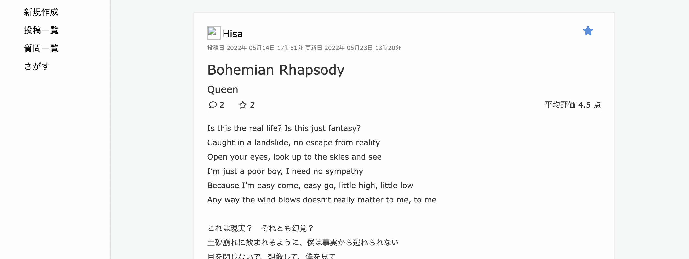

# Personal Translator

洋楽の訳詞の投稿、閲覧ができるサイトです:smile:  
翻訳した歌詞を投稿し、評価とコメントを得ることができます。   
また、曲名、歌手名で歌詞をさがしたり、お気に入りに登録したり、個人の過去の投稿や評価を見ることができます。  

##  作った理由
普段、洋楽を聞いたときにそれがどんな歌なのかを知りたくて訳を調べると、スラングやイディオムなどを訳している歌詞と機械的な翻訳をした少しわかりにくい歌詞が出てくることがあります。それらの歌詞をまとめられるサイトで訳詞の評価やユーザーの評価が一目できるサイトがあれば、簡単に質の高い訳詞を見つけることができると思い今回のサイトを作りました。  
また、歌詞に対して、コメントや質問でわかりにくい部分の質問や訳してほしい歌詞のリクエストもできればより、洋楽が楽しめると思ったためそれらの機能を加えました。

##  使い方
まず、新規登録、または、ログインが必要です。  
新規登録にはユーザー名、メールアドレス、パスワードの設定が必要になります。
- 翻訳した歌詞を投稿する  
洋楽の歌詞を翻訳して投稿することができます。  
投稿には曲名、歌手名、歌詞内容の記入が必要です。  
- 投稿にコメント、評価をする  
投稿に対して、評価点、コメントを返すことができます。  
気に入った投稿をお気に入りに登録してプロフィールの「お気に入りを見る」から確認することができます。また、投稿のユーザー名をクリックすれば、ユーザーの詳細を確認することができます。    
- 質問を投稿する  
翻訳してほしい歌詞の投稿がないとき、歌詞の訳が理解できないときなど、質問を投稿して他ユーザーに回答をお願いすることができます。質問には質問のタイトルと内容の記入が必要です。  
- 歌詞を検索する  
トップページ、検索ページの検索フォームから投稿をさがすことができます。  
トップページの検索フォームからは投稿の検索ができ、曲名と歌手名の部分一致で検索ができます。  
検索ページからは投稿、質問の両方を検索でき、部分一致、完全一致、前方一致、後方一致を選んで検索することができます。  
- プロフィールを確認、編集する  
プロフィールページから過去の投稿や質問、お気に入りを確認することができます。また、プロフィールの編集や、パスワード、メールアドレスの編集ができます。  

## 使用技術
- Ruby 2.7.3
- RUby on Rails 7.0.2
- SQlite 1.4
- Puma
- RSpec
- Rubocop

## 機能一覧
- ユーザー登録機能、 ログイン機能(devise)
  - ゲストログイン機能 
  - アイコン登録機能(carrierwave) 
- 投稿機能
- 評価、 コメント機能
- 質問投稿機能
- お気に入り登録機能
- 検索機能

## ER図

## テスト
- RSpec
  - 統合テスト(feature)
  - 単体テスト(model, helper)
  - 機能テスト(request)
